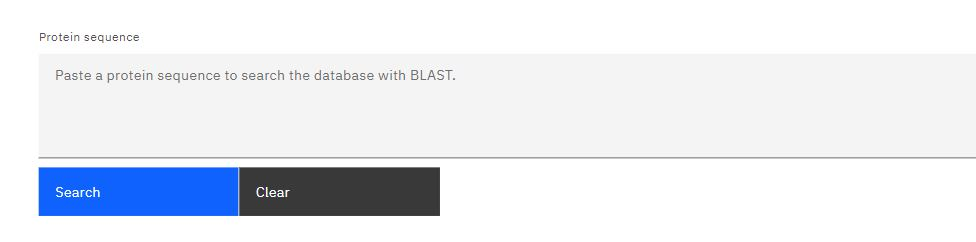
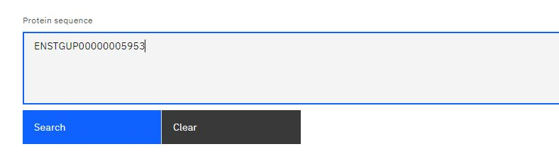
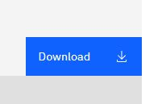

 ### <u>What is BLAST?</u>

BLAST stands for Basic Local Asignment Search Tool and it is used for comparing genomic sequence. On our website the genes that are seen are ohnologs, genes that have arisen from a Whole Genome Duplication (WGD) event.

### <u> Using the Table </u>

In this part of the website you have the ability to search for all sequences in our database that are similar to the sequence you chose. This is a great feature if you have a particular gene in mind and want to find all of its ohnologs and orthologs. To do this you will first need to type in a protein sequence and use the 'Search' button to update the table at the bottom of the page. If you wish to search for another gene sequence, or if you have made a mistake, click the grey 'Clear' button and type another sequence in.

 

This is the search box you use to paste and find a specific protein sequence on our database:

Example of a protein sequence being searched:

Example of a table being generated using the protein sequence as the input:

(not yet available)

 

<u>The table's headings are listed as follows:</u>

| Gene | Protein | Species | Source | Scaffold | Segment | Labels |

The points below explain what each header in the table refers to, 

<ul>
<li><b>Gene:</b> Name of the gene</li>
<li><b>Protein:</b> Name of the protein</li>
<li><b>Species:</b> Name of the species</li>
<li><b>Source:</b> Where the data in the table came from. The possible sources are Ensembl, RefSeq or other</li>
<li><b>Scaffold:</b> This is the joining of a genomic sequence's non-contiguous series</li>
<li><b>Segment:</b> How many segments are there in the genome</li>
<li><b>Labels:</b> Evidence-based. They will either be micro-synteny, macro-synteny or gene phylogeny</li>
</ul>
 

The data on our website is freely available to the public and you are free to download it all or only pick and choose your favourite genes. You must first use the search box above the table to look for a gene sequence. You can then click the blue 'Download' box on the right side of the table.

Look for this button on the tables if you wish to download any data from our site:

 

