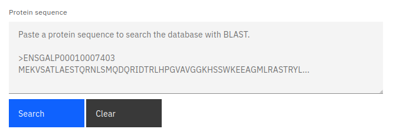

### Introduction

Our website provides a way to search our database by protein sequence similarity using BLAST. This can be useful if you have a specific gene of interest and a) it is not currently in our database, or b) you also want to analyse its homologs.

### BLAST input

The BLAST input should be provided in the provided text area in FASTA format; The header line should contain the '>' character immediately followed by the protein identifier. The protein sequence should start on a new line following the header and may be split into multiple lines.

:::note

We only support a single FASTA entry at any one time.

:::

In order to begin the BLAST search, press the search button below the text area. Alternatively, you can clear the text area by pressing the cancel button. The search may take around 10 seconds - any results will be displayed in a table below the input fields.

### Data table

The gene table displayed on this page follows our standard layout, you can read more about it [here](/#tables).

### Data download

All gene data returned from the BLAST search can be downloaded by pressing the download button above the table. If you want to download a subset of the data, you can read more about selecting table entries [here](/#filtering-and-selection).

:::caution

Only the genes returned by the BLAST search can be downloaded from this page.

:::

### Linking

You can view more information about a gene by clicking on any of the entries listed under the source table column.

You can also jump to the gene tree or synteny data visualisations containing any particular gene entry by clicking any of the links in the protein column. You can read more about data linking [here](/#linking).
