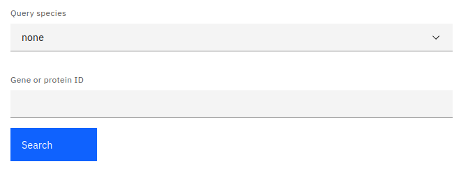
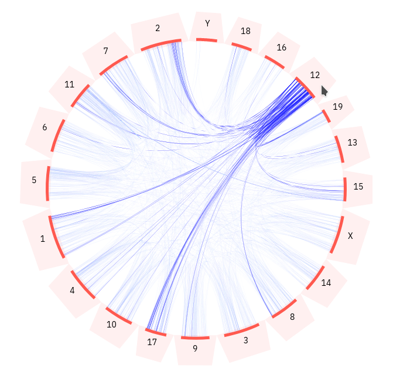

### Introduction

Our website provides dynamically-generated circos plots. Circos plots are useful for visualising the locations of ohnolog pairs within a genome and any patterns pertaining to such relationships. A whole genome duplication results in an exact copy of each chromosome. Therefore, we expect ohnolog pairs to be arranged in blocks, following these duplicated chromosomal regions. This type of syntenic relationship can be seen in circos plots.

### Circos settings

In order to display a circos plot, you must first select a species whose genome you wish to plot. This can be done in two ways; The simplest way to pick a species is to select it using the provided dropdown menu. Alternatively, you can enter a gene or protein identifier into the provided textbox and press the search button. This will match the identifier against our database and attempt to find the species whose genome it belongs to.

Selecting the query species will generate a circos plot and display a table containing every gene from the selected species.

### Reading the plot

The plot shows all the chromosomes in the query species and the ohnolog pairs between different chromosomes. Chromosomes are displayed as orange lines arranged in a circle. Each chromosome has an associated label and selection area (light orange). Ohnologous relationships between genes are represented by blue arcs.

:::note

Chromosome lengths are to scale. The start/end points of lines representing ohnologous relationships are the mid-point positions of genes.

:::

You can interact with the plot by hovering the mouse cursor above any of the chromosome selection areas. This will highlight all of the ohnologous relationships for genes that are location on that chromosome.

Any ohnologous relationships involving genes that are currently in your selection will be highlighted in green. You can add genes to your selection using the table below the plot. You can read more about how gene selection works [here](/#filtering-and-selection).

### Data table

All genes belonging to the query species will be shown in a table below the circos plot. The table displayed on this page follows our standard layout, you can read more about it [here](/#tables).

### Data download

All gene data used for generating the current plot can be downloaded by pressing the download button above the table. If you want to download a subset of the data, you can read more about selecting table entries [here](/#filtering-and-selection).

:::caution

Only genes displayed in the circos plot can be downloaded from this page.

:::

### Linking

You can view more information about a gene by clicking on any of the entries listed under the source table column.

You can also jump to the gene tree or synteny data visualisations containing any particular gene entry by clicking any of the links in the protein column. You can read more about data linking [here](/#linking).
