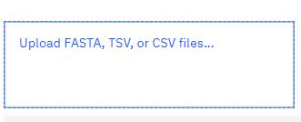
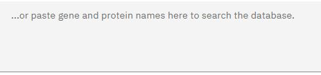
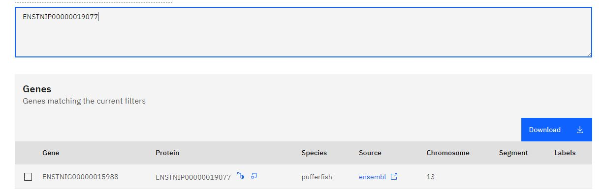

### <u> Uploading Files </u>

The option to drop files onto our website is a helpful tool. You can locate and drop files, the type of files you are able to upload are explained in the 'Special Notes' section of this guide, onto the website using the box on the top left of the page and results for the genes in your file will be displayed on the table once the file has been uploaded. This is great if you are conducting research and need to seek for a certain gene in a file you are looking at.

Clicking the 'Upload' link will take you to your files where you can search for the file you wish to upload. When the file is uploaded all the genes/proteins in your file will be identified and the database will be search for them using your genes/proteins as an input:

 

 
### <u> Using the Table</u>

The table on this part of the website is good if you have a favourite gene and want to find all its ohnologs or orthologs (that are also ohnologs) in our database. There are two ways to find them. The first way is to directly upload a file to the site , as explained previosuly, or to manually look for a gene/protein using the search box (underneath the upload box). Both of these methods will automatically update the table to locate the gene/protein you are looking for on our database. 

This is search box for manually searching for gene/protein names:
 

 This an example of table generated using the protein 'ENSTNIP00000019077' as the input, note the download button (rhs):
  

You can download any of the data found on the website. To do this go to the section of the website that has the data you would be looking for, genes/genomes/proteins, and use the selction boxes to refine your search. Once the table has been updated there will be a 'Download' button on the right hand side of the table. Note that if you have previosuly made any selections they will persist across both pages and become selected in the tables. If you wish to avoid this click the 'Cancel' button found on the top right of the table.

Look for this button on the tables if you wish to download any data from our site:

 

