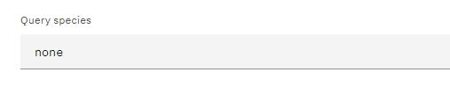
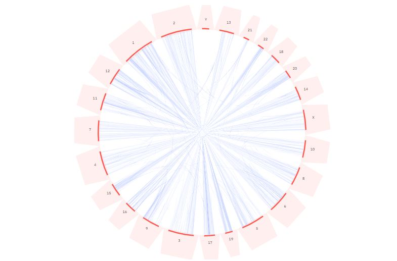
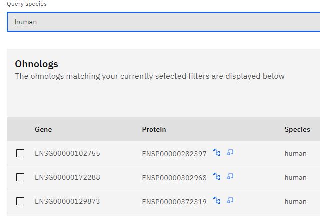

### <u> Circos Plots </u>

Circos plots are circular visual displays used for showing genomic data. They make it easy to visualise certain genomic patterns. In our case it shows gene paralogy relationships.The arcs which compose the circle are chromosomes and are labelled as such. All the lines on the inside of the circle going from chromosome to chromosome are homologous genes. Blocks are charecteristic of whole genome duplications and you may see this on your plot, they will appear as many genes in the same location on the plot.

### <u> Creating a Circos Plot</u>

As mentioned previously, circos plots are very useful for displaying all kinds of genomic data in a simplistic way that makes it easy to understand. In order to make a circos plot on our website you will need to select the species of choice in the search boxes called 'Query species' and click enter. Note that only one species can be selected for the circos plot at a time and that once a circos plot has been created, the gene table will be at the very bottom of the page and the plot will change based on selection. 

This is the dropdown menu ('query species') used on this section of our website:
 

 
This is an example of a circos plot that has been generated when 'human' was used as the query species:
 

This is an example of a table generated , located below the circos plot, using 'human' as the query species in the dropdown menu, note the download button (rhs):
  

Once you have made a circos plot you can hover over the chromosomes, on the outside of the circle, to highlight paralogy relationships. Other relationships will be dimmed until hovered over.

Refreshing the page or going to another section of the website and coming back will both remove the circos plot you made.

### <u> Using the Table </u>

Once you have created you circos plot the table will list all the genes and proteins it has for the query species you selected previously. With this you can download any data that is relevant to you by selecting it from the table and using the blue 'Download' button found at the top right of the table.

If you are looking for further information relating to a particular gene, there are external links under the 'Source' heading on the table which leads to Ensembl. Similar to that, there are two internal links under the 'Protein' heading on the table. The blue icon to the left will take you to the tree section of the website and the blue icon to the right will take you to the synteny section of the website.  From there, the selection you made will persist across both pages and become selected in the tables. If you wish, you have the ability to download the data you are interested in.

Look for this button on the tables if you wish to download any data from our site:

 

### <u> Ensembl and Internal Links </u>

Ensembl is a genome database, this was included so that users can find more in-depth information relating to a certain gene of interest. There are also external links on the website under the 'Source' heading of the tables, these lead to external databases and from there you can search for other genes or genome sequences. 

External link for the Ensembl database:
  

In addition to this, there are two internal links in the table under the 'Protein' heading. These links will lead you to the 'Phylogeny' and 'Synteny' pages within our website. The blue icon on the left will lead you to the phylogeny page and the blue icon on the right will lead you to the synteny page. If you have previosuly made any selections they will persist across both pages and become selected in the tables which means (fortunately) you do not have to manually make the same selections again. However, if this is something you wish to avoid then click the 'Cancel' button found on the top right of the table.

Internal link for the <b>Phylogeny</b> section:
  

Internal link for the <b>Synteny</b> section:
 

