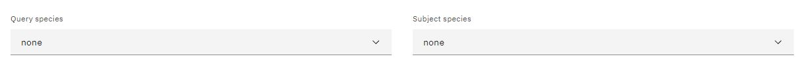
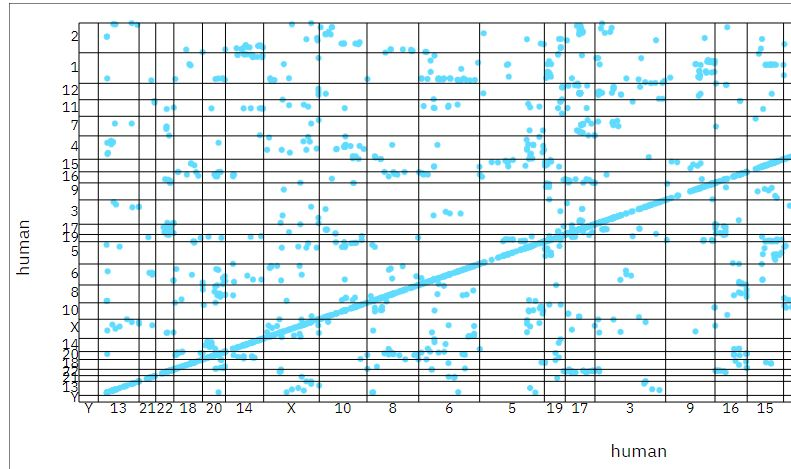
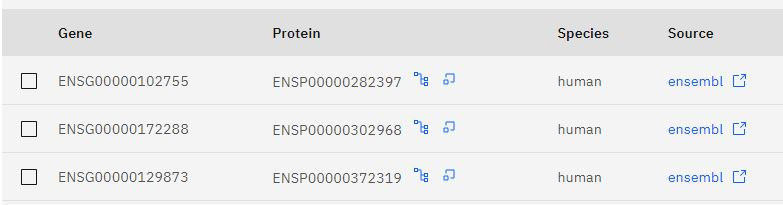
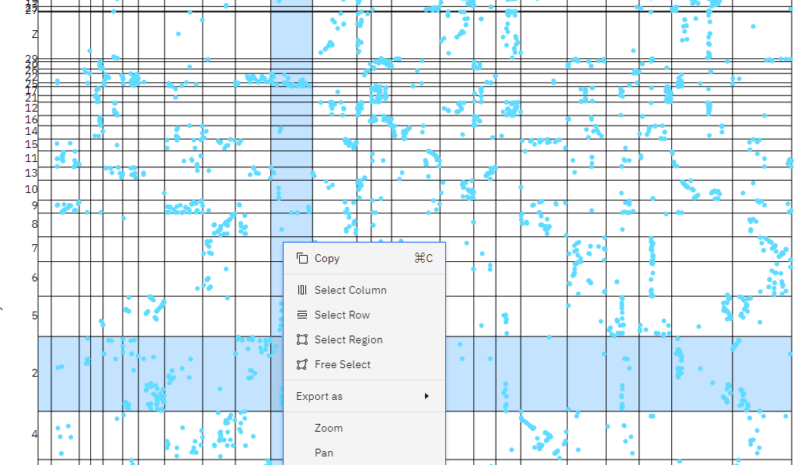
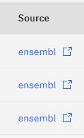
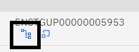
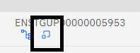

### <u> Dotplots </u>

Dotplots can be used to compare the genomes of two different species. In essence, it has a vertical and horizontal axis with scattered data in the form of dots. It is a way to visualise the provided data and to recognise, simply, the similarities and differences between species. 

Dotplots are very useful for identifying various patterns of synteny. When the same query species is chosen, micro-synteny is detected by long, continuous lengths. On our site the dots represent homology relationships. Clusters of dots, whether or not they are in the same region, is characteristic of macro-synteny.

You can also see chromosomal inversions on your dotplot. Look for breaks in contiguous lines, with the broken area being a shorter line at a 90-degree angle.

Additionally, duplicates can be noticed; a chromosome's location may correspond to several locations.

### <u> Constructing a Dotplot </u>

You can create your own dotplot on our website with ease to compare the genomes of two different species of choice. Choose the species you want to view on the dotplot from the drop-down menus in the 'Query species' and 'Subject species' boxes at the top of the 'Dotplot' section. The same species may be used twice, but in order for the dotplot to be created, you must select an option in both of the boxes.

These are the dropdown menus available to you on the 'Dotplot' section:

After making your selections in both menus a dotplot will be automatically contstructed, such as the one below that was made where 'Human' and 'Turkey' were the query species:

Below your dotplot will be a table with data , such as genes and proteins, of your chosen species such as this one:

Refreshing the page or going to another section of the website and coming back will both remove the doplot you made as well as any data you may have selected from the table.

### <u> Selection Tools </u>

There are many tools you can use on the website when constructing your dotplot. Your dotplot will display all the genes you've chosen as orange dots, making it simple to keep track of the genes. Right-clicking anywhere on the plot will bring up a context menu where you can select rows, colums, regions, etc. This menu will act on all the genes in a particular box, not any one specific gene. 

This is the menu that will appear when you right-click on the plot:

### <u> Using the Table </u>

To view the genes and proteins of a specific species you will first need to select the same species in both the 'Query species' and 'Subject species' found at the top of the page, this will update the table to show all the relevant data. You can refresh the page to clear the search boxes and the table if you wish to re-enter a new species. 

### <u> Ensembl and Internal Links </u>

Ensembl is a genome database, links to this external database were included so that users can find more in-depth information relating to a certain gene if the website does not have it. There are external links on the website under the 'Source' heading of the tables, some of them lead to this browser and from there you can search for other genes or genome sequences. 

External link for the Ensembl database:

There are also two internal links in the table under the 'Protein' heading, these will lead you to the 'Phylogeny' and 'Synteny' pages. The blue icon on the left will lead you to the phylogeny page and the blue icon on the right will lead you to the synteny page. From there, the selection you made will persist across both pages and become selected in the tables. If you wish, you have the ability to download the data you are interested in. 

Internal link for the <b>Phylogeny</b> section:

Internal link for the <b>Synteny</b> section:
 

