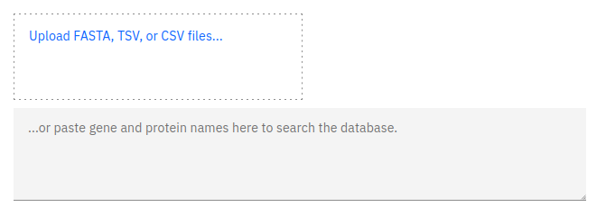

### Introduction

Our website provides a way to search our database using a pre-existing list of gene and protein identifiers. This can be useful if you already know which genes you want to analyse.

### Search input

Gene lists can be provided in multiple formats, we support the following:

- FASTA files.
- TSV/CSV files.
- TXT files.

:::note

Any text that is not a gene or protein identifier will be ignored. Generally, most gene list formats *should* work as long as they use commas and tabs to delineate identifiers.

:::

In order to search our database, you can either upload the desired gene list, or paste it into the provided text area. Uploading files can be done in two ways: You can drag the desired file onto the upload area, or alternatively, you can click on the upload area which will open your system's native file picker.

Once the gene list has either been uploaded or pasted, the search will begin automatically and any results will be displayed in a table below the input fields.

### Data table

The gene table displayed on this page follows our standard layout, you can read more about it [here](/#tables).

### Data download

All gene data returned from the database search can be downloaded by pressing the download button above the table. If you want to download a subset of the data, you can read more about selecting table entries [here](/#filtering-and-selection).

:::caution

Only the genes returned by the database search can be downloaded from this page.

:::

### Linking

You can view more information about a gene by clicking on any of the entries listed under the source table column.

You can also jump to the gene tree or synteny data visualisations containing any particular gene entry by clicking any of the links in the protein column. You can read more about data linking [here](/#linking).
