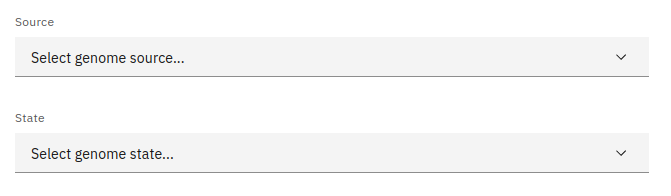

### Introduction

Our website provides an interface for easily viewing and filtering all the species in our database.

### Filtering

Our filtering feature allows users to narrow down the dataset to their liking without the need to download it first. Species data can be filtered by multiple attributes:

- **Source:** The genome database from which a genome was sourced.
- **State:** Whether a genome is present-day or an ancestral reconstruction.

### Data table

The table on this page displays all the species present in our database that match your selected filters.

The table on this page contains the following information:

- **Species:** The species name.
- **State:** If the genome is present-day or an ancestral reconstruction.
- **Source:** The database from which the genome was sourced.
- **Version:** The version of the genome (corresponds to external database versions).
- **Completeness:** If the assembly is chromosome or scaffold level.
- **Chromosomes:** The number of chromosomes (or scaffolds in the case of a scaffold-level assembly) in the genome.
- **Segments:** The number of macro-synteny segments in the genome.
- **Genes:** The number of genes in the genome.

### Data download

All gene data can be downloaded by pressing the download button above the table. If you want to download a subset of the data, you can read more about selecting table entries [here](/#filtering-and-selection).

### Linking

You can view more information about a species by clicking on any of the entries listed under the source table column.
