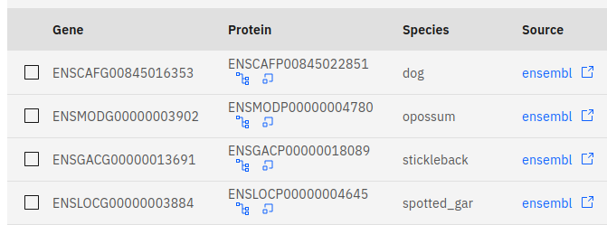
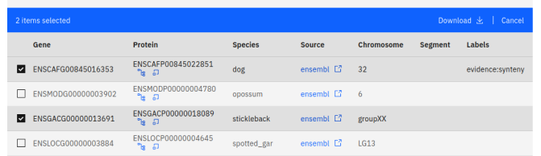

### Introduction

There is a general lack of easily accessible, high-quality ohnolog databases - while several datasets exist, they are either badly documented, or lack (in our opinion) crucial data filtering and visualisation features. We aim to offer a service that attempts to address all the shortcomings of current alternatives:

- **Multiple sources of evidence** (macro-synteny, micro-synteny, and gene trees) are used to classify genes are ohnologs.
- We **distinguish between 1R and 2R** duplicate pairs.
- We offer **multiple ways to filter and select** genes from our dataset.
- Users can **browse our data** before downloading using our online interface.
- We offer multiple ways to **visualise and analyse** our dataset.
- Our pipeline is **well documented, freely available, and reproducible**.

### Features

The features available on our website are summarised below. Each feature is documented more thoroughly on its dedicated docs page.

###### Download our data

If you want to download our entire dataset, [click here](). Alternatively, you can choose what data to download by browsing to one of the following pages:

- Species page - [docs](/guides/species) | [website](https://ohnologs.com/species)
- Gene page - [docs](/guides/genes) | [website](https://ohnologs.com/gene)

###### Search our data

If you already have some genes of interest and want to search our database with those in mind, you can do so by browsing to one of the following pages:

- Selection page - [docs](/guides/select) | [website](https://ohnologs.com/select)
- BLAST page - [docs](/guides/blast) | [website](https://ohnologs.com/blast)

###### Visualise our data

If you want to visualise the data that you have selected, be that single genes or entire genomes, you can generate figures in real time on the following pages:

- Circos page - [docs](/guides/circos) | [website](https://ohnologs.com/circos)
- Dotplot page - [docs](/guides/dotplot) | [website](https://ohnologs.com/dotplot)
- Phylogeny page - [docs](/guides/tree) | [website](https://ohnologs.com/tree)
- Microsynteny page - [docs](/guides/synteny) | [website](https://ohnologs.com/synteny)

### Use cases

The tools provided on our website can be useful for data-exploration and simple analyses. Below is a (far from exhaustive) list of problems that our website can solve:

##### I have a favourite gene

You can visit the [BLAST](https://ohnologs.com/blast) page to find homologs of your favourite gene that are present in our database. The resulting genes can either be downloaded or selected. Any genes that are currently in your selection will be highlighted across all plots on our website.

##### I'm interested in a specific gene family

You can visit the [selection](https://ohnologs.com/select) page and provide a FASTA or TSV file to find any matching genes that are present in our database. The results can either be downloaded or selected. Any genes that are currently in your selection will be highlighted across all plots on our website.

##### I like pretty graphs

You're in luck! You can visit any of the [circos](https://ohnologs.com/circos), [dotplot](https://ohnologs.com/dotplot), [tree](https://ohnologs.com/tree), or [synteny](https://ohnologs.com/synteny) pages and (hopefully) enjoy what you see ;). If you're still not satisfied, let us know what we can do to satiate your immeasurable hunger for pretty graphs.

##### I'm confused

You're in the right place! We provide comprehensive documentation for each feature available on our website. If you don't feel like reading, visit a [random page](...) and go exploring. That'll work too... probably.

### Our data

The genes in our dataset are displayed using a combination of tables and figures. Below is a summary of the various ways that users can view and interact with our data.

##### Tables

Most of the pages on our website contain data tables which are located towards the bottom of each page. These tables display all the genes in our database that match your selected filters, or in the case of figures, the table displays all of the genes that appear in a figure.

Most tables contain the following information for each gene:

- **Gene:** The gene identifier.
- **Protein:** The protein identifier.
- **Species:** The species whose genome this gene belongs to.
- **Source:** The database from which the genome was sourced.
- **Chromosome:** The chromosome that the gene belongs to.
- **Segment:** The macro-synteny segment that the gene belongs to.
- **Labels:** The evidence that suggests that this gene is an ohnolog.

##### Data download

The data on the website is completely accessible to the public, and can be easily downloaded. To download all the data displayed in a table, you can click the download link located above the table entries.

Any data data downloaded from the website will be provided in a zip archive containing the following files:

- **sources.tsv** - A list of genomic databases from which our data was sourced.
- **species.tsv** - A list of species.
- **scaffolds.tsv** - A list of chromosomes/scaffolds.
- **segments.tsv** - A list of chromosomal segments.
- **families.tsv** - A list of gene families.
- **genes.tsv** - A list of genes.
- **labels.tsv** - A list of evidence-based ohnology labels used in our dataset.
- **gene_labels.tsv** - A list of gene-label associations.
- **gene_ohnology.tsv** - A list of ohnolog pairs and their relationship (1R vs 2R).
- **trees.tsv** - A list of gene trees.
- **tree_species.tsv** - A list of species appearing in each gene tree.
- **tree_genes.tsv** - A list of genes appearing in each gene tree.
- **synteny_blocks.tsv** - A list of micro-syntenic blocks.
- **synteny_tracks.tsv** - A list of continuous chromosomal segments that are part of micro-syntenic blocks.
- **synteny_groups.tsv** - A list of homologous genes present in micro-syntenic blocks.
- **synteny_genes.tsv** - A list of genes present in micro-syntenic blocks

###### Sources

The sources file contains the following columns:

- **SourceId** - Genomic database unique identifier.
- **Name** - Genomic database name.

###### Species

The species file contains the following columns:

- **Source Id** - Genomic database unique identifier.
- **Species Id** - Species unique identifier.
- **Name** - Species name.
- **Version** - Genome version.
- **Assembly** - Genome assembly type (chromosome or scaffold).
- **Outgroup** - Whether this species was used as an outgroup in the gene tree analysis.
- **Reconstruction** - Whether this genome is an ancestral reconstruction.

###### Scaffolds

The scaffolds file contains the following columns:

- **Species Id** - Species unique identifier.
- **Scaffold Id** - Chromosome/scaffold unique identifier.
- **Start** - Chromosome/scaffold start coordinate.
- **End** - Chromosome/scaffold end coordinate.

###### Segments

The segments file contains the following columns:

- **Species Id** - Species unique identifier.
- **Scaffold Id** - Chromosome/scaffold unique identifier.
- **Segment Id** - Segment unique identifier.
- **Start** - Segment start coordinate.
- **End** - Segment end coordinate.

###### Families

The families file contains the following columns:

- **Family Id** - Family unique identifier.

###### Genes

The genes file contains the following columns:

- **Species Id** - Species unique identifier.
- **Scaffold Id** *(optional)* - Chromosome/scaffold unique identifier.
- **Segment Id** *(optional)* - Segment unique identifier.
- **Family Id** *(optional)* - Family unique identifier.
- **Gene Id** - Gene unique identifier.
- **Protein Id** - Protein unique identifier.
- **Start** - Gene start coordinate.
- **End** - Gene end coordinate.
- **PGC** - The proto-gnathostome chromosome that the gene has been assigned to.
- **PVC** - The proto-vertebrate chromosomes from which the gene's PGC is derived.

###### Labels

The labels file contains the following columns:

- **Label Id** - Label unique identifier.
- **Name** - Label name.

###### Gene labels

The gene labels file contains the following columns:

- **Protein Id** - Protein unique identifier.
- **Label Id** - Label unique identifier.

###### Gene ohnology

The gene ohnology file contains the following columns:

- **Query Id** - Protein unique identifier of the query gene.
- **Subject Id** - Protein unique identifier of the subject gene.
- **Relation** - Whether the pair is related by 1R (r1) or 2R (r2).

###### Trees

The trees file contains the following columns:

- **Tree Id** - Tree unique identifier.
- **Newick** - Newick string of the tree.

###### Tree species

The tree species file contains the following columns:

- **Tree Id** - Tree unique identifier.
- **Species Id** - Species unique identifier.

###### Tree genes

The tree genes file contains the following columns:

- **Tree Id** - Tree unique identifier.
- **Protein Id** - Protein unique identifier.

###### Synteny blocks

The synteny blocks file contains the following columns:

- **Block Id** - Block unique identifier.

###### Synteny tracks

The synteny tracks file contains the following columns:

- **Block Id** - Block unique identifier.
- **Species Id** - Species unique identifier.
- **Scaffold Id** - Chromosome/scaffold unique identifier.
- **Start** - Start coordinate of the micro-synteny track.
- **End** - Start coordinate of the micro-synteny track.

###### Synteny groups

The synteny groups file contains the following columns:

- **Block Id** - Block unique identifier.
- **Group Id** - Group unique identifier.

###### Synteny genes

The synteny genes file contains the following columns:

- **Block Id** - Block unique identifier.
- **Species Id** - Species unique identifier.
- **Scaffold Id** - Chromosome/scaffold unique identifier.
- **Group Id** - Group unique identifier.
- **Protein Id** - Protein unique identifier.

:::note

If any of the table entries are selected, pressing the download button will only download the selected entries. The selection can be cleared by pressing the cancel button located above the table.

:::

##### Linking

The tables on our website contain links to external databases that can help you to find more in-depth information regarding the genes that you are interested in. These links can be found under the source heading of tables, which are located towards the bottom of a page. These lead to gene extried in external databases such as Ensembl.

In addition to this, there are two internal links in each table under the protein heading. These links will lead you to the phylogeny and synteny pages within our website - a quick way to get more information about a gene that might interest you. When jumping to these pages, any selection you may have made on the current page will persist to the target page.

##### Filtering and selection

Our filtering utilities allow users to select a specific subset of our database based on certain criteria. These criteria can be gene attributes - such as the chromosome that a gene belongs to. Data filtering can be done on the [gene](/guides/genes) and [species](/guides/species) pages using dropdown menus to select data attributes that you wish to keep. Alternatively, data can be filtered to include only specific gene/protein identifiers or similar protein sequences using our [selection](/guides/selection) and [BLAST](/guides/blast) utilities respectively. Once filters have been applied on any page of our website, any data that passes these filters will be displayed in a table at the bottom of the page.

:::note

If any filters are applied, the download button above a table will only download the subset of our dataset that passes the applied filters.

:::

Our website allows users to select data displayed in tables - it is a form of manual filtering and curration. However, unlike filtering, your selection is global - it persists across all pages - and any genes currently in your selection are highlighted in all the figures generated by our website. Genes can be added to or removed from the selection using the toggles on the left side of a table.

You may find selection useful if:

- You are interested in a specific subset of genes.
- You have applied some filters, and want the filtered genes to be highlighted in figures.

:::note

If there are any genes currently in your selection, pressing the download button above a table will only download the genes in your selection. You can clear your selection by pressing the cancel button above the table.

:::

##### Visualisation

The final way that our data is displayed (and can be interacted with) is through multiple figures generated in real time on our website. These include [circos plots](/guides/circos), [dotplots](/guides/dotplot), [gene trees](/guides/tree), and [synteny plots](/guides/synteny). Each figure can iteract with the global gene selection:

- Genes that are selected will be highlighted in figures.
- There are multiple utilities that allow users to visually add/remove genes to/from the selection by interacting with each figure.

More details regarding the specifics of visual selection can be found on the individual documentation pages for each figure.

### Useful terms

Below are some key terms that are useful to know when navigating the website:

- **Whole genome duplication:** A major evolutionary event whereby all genomic material is doubled.
- **Ohnologs:** Duplicates arising as a result of a whole genome duplication event.
- **Micro-synteny:** Conservation of gene content and order.
- **Macro-synteny:** Conservation of gene content.
